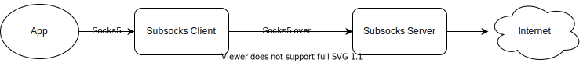

# Subsocks

A Socks5 proxy that encapsulates Socks5 in other security protocols

[](https://github.com/luyuhuang/subsocks/actions)
[](https://github.com/luyuhuang/subsocks/releases)
[](https://hub.docker.com/r/luyuhuang/subsocks)

## Introduction

Subsocks is a secure Socks5 proxy. It encapsulate Socks5 in other security protocols such as HTTPS and Websocket instead of using Socks5 directly. Socks5 is fully supported (Connect, Bind, UDP associate), and extending Socks5 to make UDP over TCP possible. It helps you optimize your network or bypass firewalls that only allow some particular protocols.


- [x] Fully support Socks5 (Connect, Bind, UDP associate)
- [x] Support HTTP proxy
- [x] Transport over HTTP / HTTPS
- [x] Transport over Websocket
- [x] HTTP authorization
- [x] Smart proxy

## Installation

### go get

Subsocks is written by Go, If you have Go environment, using `go get` is one of the easiest ways.

```sh
go get github.com/luyuhuang/subsocks
```

### Docker

```sh
docker pull luyuhuang/subsocks
```

### Binary file

Download the binary file from the [release page](https://github.com/luyuhuang/subsocks/releases).

### Build from source code

You can also build from source code.

```sh
git clone https://github.com/luyuhuang/subsocks.git
cd subsocks
go build
```

## Usage

### Getting started

A Subsocks instance may be a client or a server, determined by the configuration. A Subsocks client receives Socks5 data from Apps and encapsulate Socks5 data into a security protocol like HTTPS, then forward it to the Subsocks server. The Subsocks server unpacks the data from the client and accesses the internet.



Create the client configuration file `cli.toml` with the following content:

```toml
[client]
listen = "127.0.0.1:1030"

server.protocol = "https"
server.address = "SERVER_IP:1080" # replace SERVER_IP with the server IP

http.path = "/proxy" # same as http.path of the server
tls.skip_verify = true # skip verify the server's certificate since the certificate is self-signed
```

Then start the client:

```sh
subsocks -c cli.toml
```

Similarity, create the server configuration file `ser.toml`:

```toml
[server]
listen = "0.0.0.0:1080"
protocol = "https"

http.path = "/proxy"
```

And then start the server:

```sh
subsocks -c ser.toml
```

### With Docker

Download `docker-compose.yml`:

```
wget https://raw.githubusercontent.com/luyuhuang/subsocks/master/docker-compose.yml
```

Create the configuration file `config.toml`:

```toml
[server] # no one will use docker for the client, right?

# must be "0.0.0.0:1080". It's just the address in the
# container, modify the real address in docker-compose.yml
listen = "0.0.0.0:1080"

protocol = "https"
# other fields ...
```

Launch:

```sh
docker-compose up -d
```

> NOTICE: If you want to use a custom certificate, edit `docker-compose.yml` and create a volume to map it to the container.

## Configuration

Subsocks configuration format is [TOML](https://github.com/toml-lang/toml), which is easy and obvious.

### Client configuration

The client configuration format is as follows:

```toml
[client] # client configuration

listen = "127.0.0.1:10030"

username = "admin"
password = "123456"

server.protocol = "wss"
server.address = "10.1.1.1:443"

http.path = "/proxy"

ws.path = "/proxy"

tls.skip_verify = false
tls.ca = "server.crt"
```

#### Basic fields

- `listen`: string, the client socks5/http listening address.
- `username`, `password`: string, username and password used to connect to the server.
- `server.protocol`: string, protocol of the server, the value may be:
    - `socks`: pure socks5;
    - `http`, `https`: HTTP and HTTPS;
    - `ws`, `wss`: Websocket and Websocket Secure.
- `server.address`: string, address of the server.

#### HTTP

If `server.protocol` is `http` or `https`, `http.*` is enabled.

- `http.path`: string, HTTP request path. Default `/`.

#### Websocket

If `server.protocol` is `ws` or `wss`, `ws.*` is enabled.

- `ws.path`: string, Websocket handshake path. Default `/`.

#### TLS/SSL

If the protocol is over TLS, i.e. `server.protocol` is `https` or `wss`, `tls.*` is enabled.

- `tls.skip_verify`: boolean, skip verifying the server's certificate if the value is true. Default false. It's not safe to skip verifying the certificate, if the server's certificate is self-signed, please set `tls.ca` to verify the certificate.
- `tls.ca`: string, a certificate file name. It's optional. If set, Subsocks will use the specific CA certificate to verify the server's certificate.

#### Smart Proxy

If there is a `rules` field, enable smart proxy. Smart proxy is only available for the Connect method since we don't know the real peer when using Bind or UDP Associate. There are two ways to configure proxy rules. One is setting the `rules` field to a table containing proxy rules:

```toml
[client.rules]
"www.twitter.com" = "P"
"*.github.com" = "D"
"8.8.8.8" = "P"
"1.0.1.0/24" = "D"
"2001:db8::/32" = "P"

"*" = "A"
```

Each pair in the table is a rule. The left side of `=` is the address, which can be:

- Domain, a wildcard `*` indicates all subdomains of the domain;
- IP and CIDR;
- A single wildcard `*` represents all other addresses.

The right side of `=` is the rule, which can be:

- `P`, `proxy`: always via the server;
- `D`, `direct`: always direct connect;
- `A`, `auto`: automatic detection, proxy if the direct connection fails.

Another way is using a separate file to configure rules and set the `rules` field to a string representing the file name:

```toml
rules = "rules.txt"
```

The contents of `rules.txt` are as follows:

```
www.twitter.com     P
8.8.8.8
2001:db8::/32

*.github.com        D
1.0.1.0/24

# all others is automatic detection
*   A
```

Each line is a rule, except empty lines and comment lines(starting with `#`). Each line contains an address and an optional rule, separated by several spaces. If a line doesn't have a rule, its rule is the same as the previous line.

#### Authorization

If there is a `users` field, then enable authorization. In this case, applications that use proxy via the client must be authorized. There are two ways to configure the user list. One is using the [htpasswd](https://httpd.apache.org/docs/2.4/programs/htpasswd.html) file, setting the `user` field to a string indicating the htpasswd file name:

```toml
users = "passfile"
```

Another way is configuring username-password pairs directly. Setting the `users` field to a table containing username-password pairs:

```toml
[client.users]
"admin" = "123456"
"guest" = "abcdef"
```

### Server configuration

The server configuration format is as follows:

```toml
[server] # server configuration

protocol = "wss"
listen = "0.0.0.0:443"

http.path = "/proxy"

ws.path = "/proxy"
ws.compress = true

tls.cert = "server.crt"
tls.key = "server.key"
```

#### Basic fields

- `protocol`: string, protocol of the server. Same as the `server.protocol` field of the client.
- `listen`: string, the server listening address.

#### HTTP

If `protocol` is `http` or `https`, `http.*` is enabled.

- `http.path`: string, HTTP request path. Default `/`.

#### Websocket

If `protocol` is `ws` or `wss`, `ws.*` is enabled.

- `ws.path`: string, Websocket handshake path. Default `/`.
- `ws.compress`: boolean, whether to enable compression. Default false.

#### TLS/SSL

If the protocol is over TLS, i.e. `protocol` is `https` or `wss`, `tls.*` is enabled.

- `tls.cert`: string, certificate file name.
- `tls.key`: string, key file name.

If `tls.cert` or `tls.key` is not set, key and certificate will be automatically generated.

#### Authorization

If there is a `users` field, then enable authorization. This means the client must use its username and password for authorization. Configuration of `server.users` is the same as `client.users`.
