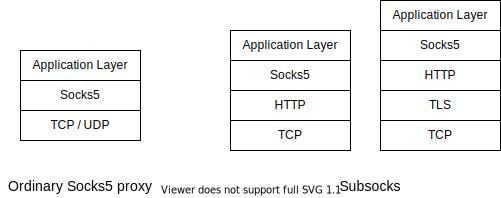

# Subsocks

A Socks5 proxy that encapsulates Socks5 in other security protocols

[](https://github.com/luyuhuang/subsocks/actions)
[](https://github.com/luyuhuang/subsocks/releases)
[](https://hub.docker.com/r/luyuhuang/subsocks)

## Introduction

Subsocks is a secure Socks5 proxy. It encapsulate Socks5 in other security protocols such as HTTPS and Websocket instead of using Socks5 directly. Socks5 is fully supported (Connect, Bind, UDP associate), and extending Socks5 to make UDP over TCP possible. It helps you optimize your network or bypass firewalls that only allow some particular protocols.



- [x] Fully support Socks5 (Connect, Bind, UDP associate)
- [x] HTTP / HTTPS
- [x] Websocket
- [x] HTTP authorization
- [ ] Smart proxy

## Installation

### go get

Subsocks is written by Go, If you have Go environment, using `go get` is one of the easiest ways.

```sh
go get github.com/luyuhuang/subsocks
```

### Docker

```sh
docker pull luyuhuang/subsocks
```

### Binary file

Download the binary file from the [release page](https://github.com/luyuhuang/subsocks/releases).

### Build from source code

You can also build from source code.

```sh
git clone https://github.com/luyuhuang/subsocks.git
cd subsocks
go build
```

## Usage

### Getting started

A Subsocks instance may be a client or a server, determined by the configuration. A Subsocks client receives Socks5 data from Hosts and encapsulate Socks5 data into a security protocol like HTTPS, then forward it to the Subsocks server. The Subsocks server unpacks the data from the client and accesses the internet.


Create the client configuration file `cli.toml` with the following content:

```toml
[client]
listen = "127.0.0.1:1030"

server.protocol = "https"
server.address = "SERVER_IP:1080" # replace SERVER_IP with the server IP

http.path = "/proxy" # same as http.path of the server
tls.skip_verify = true # skip verify the server's certificate since the certificate is self-signed
```

Then start the client:

```sh
subsocks -c cli.toml
```

Similarity, create the server configuration file `ser.toml`:

```toml
[server]
listen = "0.0.0.0:1080"
protocol = "https"

http.path = "/proxy"
```

And then start the server:

```sh
subsocks -c ser.toml
```

### With Docker

Download `docker-compose.yml`:

```
wget https://raw.githubusercontent.com/luyuhuang/subsocks/master/docker-compose.yml
```

Create the configuration file `config.toml`:

```toml
[server] # no one will use docker for the client, right?

# must be "0.0.0.0:1080". It's just the address in the
# container, modify the real address in docker-compose.yml
listen = "0.0.0.0:1080"

protocol = "https"
# other fields ...
```

Launch:

```sh
docker-compose up -d
```

> NOTICE: If you want to use a custom certificate, edit `docker-compose.yml` and create a volume to map it to the container.

### Configuration

Subsocks configuration format is [TOML](https://github.com/toml-lang/toml), which is easy and obvious.

The client configuration format is as follows:

```toml
[client] # client configuration

listen = "ADDRESS:PORT" # the client socks5 listening address

# username and password, if the server enabled authorization.
username = "USERNAME"
password = "PASSWORD"

# protocol of the server.
# - socks: pure socks5
# - http, https: HTTP and HTTPS
# - ws, wss: Websocket and Websocket Secure
server.protocol = "socks|http|https|ws|wss"

server.address = "ADDRESS:PORT"  # address of the server

# http.* is enabled when server.protocol is "http" or "https"
http.path = "PATH" # HTTP request path. defualt "/"

# ws.* is enabled when server.protocol is "ws" or "wss"
ws.path = "PATH" # websocket handshake path. default "/"

# tls.* is enabled when server.protocol is "https" or "wss"
tls.skip_verify = true|false # whether skip verify the server's certificate. default false
tls.ca = "CA" # optional. using specific CA certificate to verify the server's certificate
```

The server configuration format is as follows:

```toml
[server] # server configuration

protocol = "socks|http|https|ws|wss" # protocol of the server.
listen = "ADDRESS:PORT" # the server listening address

# http.* is enabled when protocol is "http" or "https"
http.path = "PATH" # HTTP request path. defualt "/"

# ws.* is enabled when protocol is "ws" or "wss"
ws.path = "PATH" # websocket handshake path. default "/"
ws.compress = true|false # whether to compress. default false

# tls.* is enabled when protocol is "https" or "wss"
tls.cert = "CERT" # certificate file path.
tls.key = "KEY" # key file path.
# if tls.cert or tls.key is not set, key and certificate will be automatically generated

# if there is a users field, enable authorization.

# method 1, using htpasswd file
users = "HTPASSWD" # the htpasswd file path

# method 2, configuring username-password pairs
[server.users]
"USERNAME-1" = "PASSWORD-1"
"USERNAME-2" = "PASSWORD-2"
```
